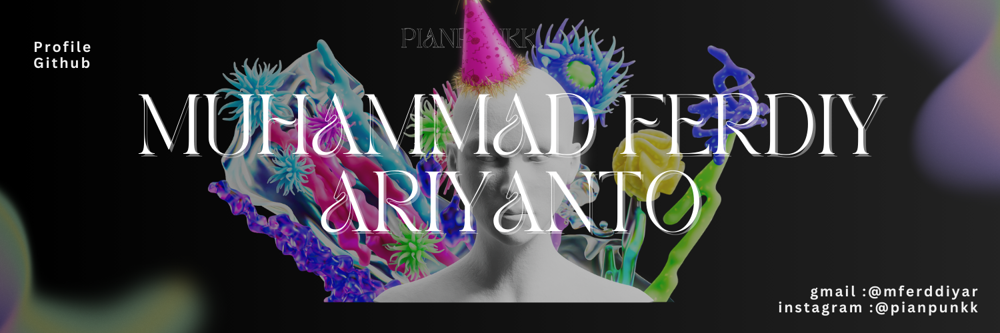

  

Hai saya Muhammad Ferdiy Ariyanto, Mahasiswa Politeknik Negeri Tanah Laut dari program studi Teknologi Informasi yang tertarik di bidang pengembangan web dan backend.  
Lagi fokus membangun berbagai project pakai Laravel dan MySQL, sambil terus belajar hal baru, ngopi, dan berteman akrab dengan error yang kadang datang tanpa permisi.

Sedang dalam perjalanan menjadi developer yang lebih rapi kodenya, lebih cepat debugging-nya, dan lebih jarang bilang “loh kok bisa error ya?”.

---

## Tech Stack

### Languages

  
  
  
  
  

### Backend & Database

  
  
  
  

### Tools & Environment

  
  
  
  

 
---

## Tools & Technologies

  
  
  
  
  
  

---

## GitHub Stats

---

## Contact

